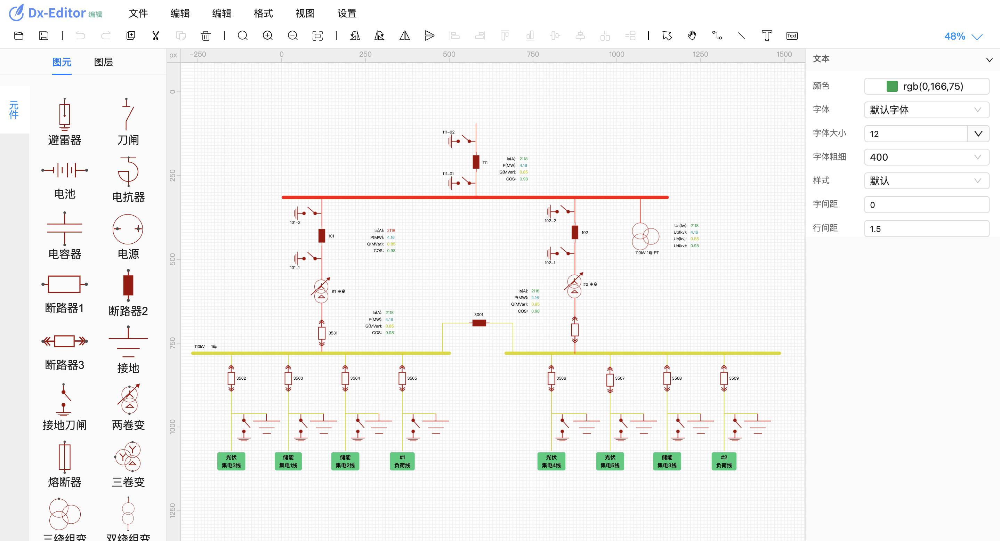

<!--
 * @Description: 
 * @Author: ldx
 * @Date: 2024-08-20 14:33:49
 * @LastEditors: ldx
 * @LastEditTime: 2024-09-12 11:27:38
-->

**dx-editor 图形编辑器**，一款开源的基于 [leaferjs](https://www.leaferjs.com/ui/) 实现的矢量图形编辑器。

[体验网址](https://leidao.github.io/dx-editor/)



## 特性

1.  图形的创建和编辑，包括：图元、线、文本；
2.  丰富的工具：选中工具、绘制图形工具、画布工具、抓手工具；
3.  无限画布，可以缩放和拖拽画布；
4.  历史记录，可撤销重做；
5.  快捷键；
6.  图层面板、属性面板；
7.  标尺功能；
8.  导入导出图纸；
9.  极轴锁定
10. 辅助线

下一步计划

- [ ] 用户设置；
- [ ] 丰富更多图形；
- [ ] 丰富属性面板。
- [ ] 线和图元的关联。

## 环境依赖

运行项目，需要安装 Node.js（建议官网 LTS 版本），然后用 Node.js 安装 PNPM 包管理器：

```sh
npm install -g pnpm
```

## 如何开发和构建产物？

进入项目文件根目录，安装依赖

```sh
pnpm install
```

开发环境（当文件修改后会自动更新刷新页面）

```sh
pnpm run serve
```