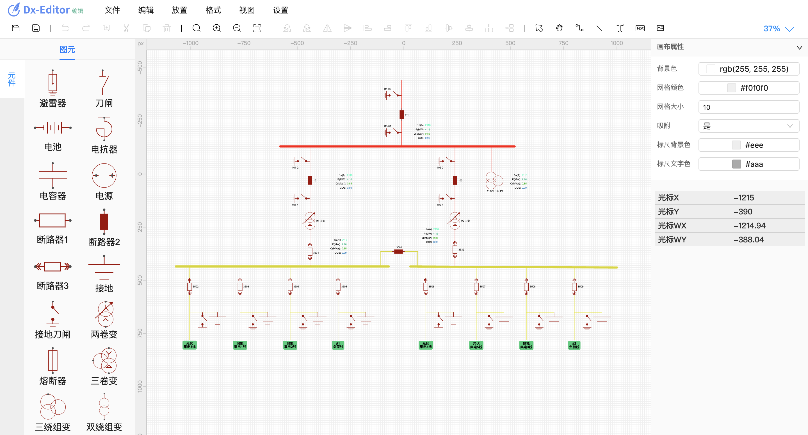
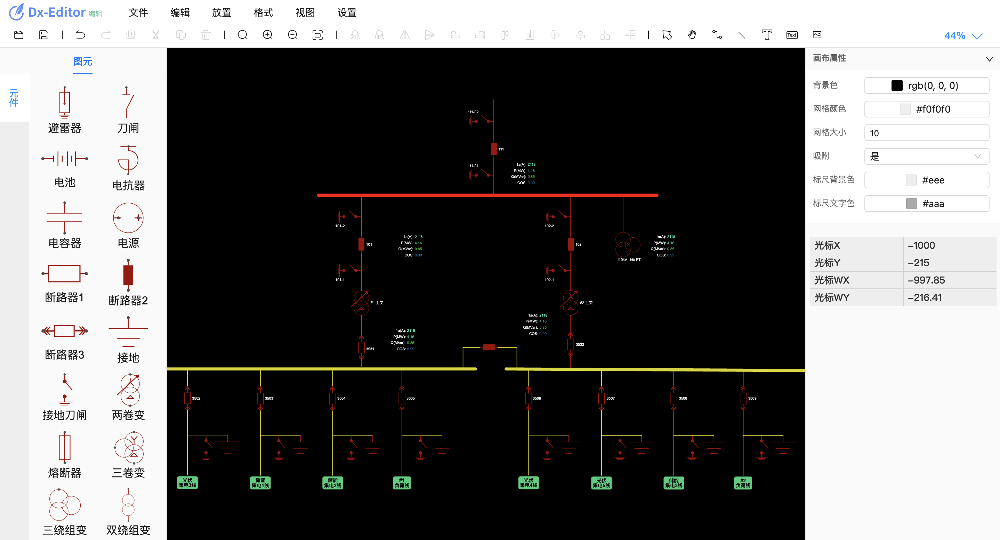

<!--
 * @Description: 
 * @Author: ldx
 * @Date: 2024-08-20 14:33:49
 * @LastEditors: ldx
 * @LastEditTime: 2024-11-06 15:29:15
-->

**dx-editor 图形编辑器**，一款开源矢量图形编辑器。

[体验网址](https://leidao.github.io/dx-editor/)




## 特性
1.  图形的创建和编辑，包括：图元、导线、母线、文本、矩形、圆和椭圆；
2.  丰富的工具：选中工具、绘制图形工具、画布工具、抓手工具；
3.  无限画布，可以缩放和拖拽画布；
4.  历史记录，可撤销重做；
5.  快捷键；
6.  层级图层面板（重命名、同级排序、显隐和锁定）、属性面板与线段折点编辑；
7.  标尺功能；
8.  JSON 图纸导入导出、当前视图 PNG 导出、本地未保存草稿恢复；
9.  工具栏

下一步计划

- [ ] 用户设置；
- [ ] 丰富更多图形；
- [ ] 丰富属性面板。
- [x] 导线端点关联图元端口，移动图元时端点跟随并保留原折线。

文件菜单的“保存”下载 JSON 图纸；“导出当前视图 PNG”只输出当前画布视口的图形，使用白色背景，不包含网格、标尺和编辑手柄。未保存的修改会在离开页面前提示，并保存在当前浏览器的本地草稿中供下次打开时恢复。草稿依赖浏览器存储空间，不替代手动保存 JSON 文件。

### 架构图
- https://www.yuque.com/renshengzhiruchujian/xvhcwk/wuskgwy42ohzyx9i?singleDoc# 《编辑器架构思路》

### 思考
- https://www.yuque.com/renshengzhiruchujian/xvhcwk/sggvx89i9l8nwcfc?singleDoc# 《思考》


## 环境依赖

运行项目，需要安装 Node.js（建议官网 LTS 版本），然后用 Node.js 安装 PNPM 包管理器：

```sh
npm install -g pnpm
```

## 如何开发和构建产物？

进入项目文件根目录，安装依赖

```sh
pnpm install
```

开发环境（当文件修改后会自动更新刷新页面）

```sh
pnpm run serve
```
